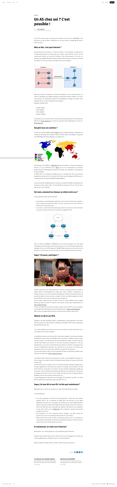

# The best I can do with k3s

When you beginner start with Minikube, you very soon find out that there are many things you don't have in Minikube, but that you of course need in a Kubernetes production Cluster, for example :
* With Minikube, if you deploy your software, even with an Ingress Controller, you can't haev access to yoru software from a network outside of the Kubernetes cluster :  you are doomed to access your software using `kubectl proxy`
* With Minikube, peristent volumes rely only on the cluster nodes storage (disks partitions), so that's very limited.
* etc... : you soon actually realize that in Minikube, you probably lack everything that you would want for your everyday software.

## The high level goals

What my final goal is with this work, is the following :
* I want to be able to create from scratch, an infrastruture which provides kubernetes clusters :
  * several kubernetes clusters, to have a dev, integration, staging, nand production cluster : with this infrastructure, I want to be able to develop a software, designed to be depoyed into Kubernetes, eventually into a production Kubernetes Cluster.
* I want to be able to build from source :
  * the version of `kubernetes` I will use
  * the version of `kubectl` I will use
  * the version of all "addons" to my `kubernetes` cluster, for example  :
    * `etcd`
    * Network `CNI` drivers/plugins, see https://kubernetes.io/docs/concepts/cluster-administration/networking/#how-to-implement-the-kubernetes-networking-model , and among those I want to ttry and compare using :
      * `Flannel`: because it is compatible with many kubernetes related open source projects
      * `Calico`: because it is compatible with many kubernetes related open source projects
      * `Jaguar` :  because it provides vxlan based overlay networking, plus it is designed for use with `OpenDaylight` (one of the main SDN Controllers known on our planet). What's funny there is taht most of the docs is in Chinese
      * `Contiv` : https://github.com/contiv/netplugin because it allows using `vxlan`, what's funny there is that the repo is not maintained (last commiut dates back years ago)
      * Here I'll also try a few others listed at https://kubernetes.io/docs/concepts/cluster-administration/networking/#how-to-implement-the-kubernetes-networking-model :
        * to have a high level view of where we are on the networking possibilites in the open source with kubernetes
        * one of the first facts that I notice : many open source solutions given by the Kuebrnetes projects, are not maintained open source projects.
        * This part is critical, as to sovereignity in infrastruture : if we can't do networking, well we can't do anything at all...
    * Kubernetes External Load Balancer Implementations. Without that component, you cannot have access to the software deployed into cluster, from a network ouside of your Kubernetes Cluster :
      * `Metallb` Load Balancer for Kubernetes https://github.com/metallb/metallb
      * `PorterLB` Load Balancer for Kubernetes https://github.com/kubesphere/porterlb
      * search on github : https://github.com/search?p=2&q=load-balancer+for+Kubernetes&type=Repositories : what is funny there
    * [`Kubernetes` CSI drivers](ccc) . There are CNI dervers for networking (Container Networking Interface), and there are CSI drivers for storage (Contnainer Storage Interface):
      * search on github for CSI drivers : https://github.com/search?q=kubernetes+csi+driver
      * For NFS : `csi-driver-nfs` see https://github.com/kubernetes-csi/csi-driver-nfs/blob/master/deploy/example/README.md
      * For Linux LVM : https://github.com/wavezhang/k8s-csi-lvm
      * For Ceph : https://github.com/ceph/ceph-csi (Ceph can be installed on private, and is open source, so I can provide my own storage, without size limmitations. Ceph can provide both Object Storage (S3) and Block Storage (usual disks)
      * For Dropbox : https://github.com/woohhan/dropbox-csi
      * For SMB , SAMBA, Windows share, network file sytems : https://github.com/alternative-storage/cifs-csi
      * For https://github.com/LINBIT/linstor-server (I wanna try that one cause its pure block storage no surprise) : https://github.com/piraeusdatastore/linstor-csi
      * EAch cloud provider has its own CSI driver, AWS EBS, etc...
    * [`kubernetes` volume plugins](https://kubernetes.io/docs/concepts/storage/volumes/#volume-types) (peristent storage provider) :
      * `Openstack` `Cinder` `kubernetes` volume plugin :
      * `GlusterFS` `kubernetes` volume plugin :
        * because glusterfs has a lot of features, interesting for production env. like :
          * you can read / write to a `GlusterFS` Volume using multiple means : FUSE (the standard read/write for GLusterFS), `NFS v4`, `SMB v3` (to read write to volume the microsoft windows way), Swift (to read / write just like with an S3 Bucket)
          * you have a geo replication feature : allows to replicate your data to remote sites, it is asynchronous, and it can be "chained" (replicate to site `A` then to site `B`, then To site `C`, etc...)
          * you have volume SNAPSHOT feature : but that not made to backup, backups should be done using geo-replication
          * it seems that `GlusterFS` is particularly fit to work with SDN (`OpenDaylight`...) :
          * https://www.youtube.com/watch?v=5aqC7GgCiqA
          * https://www.youtube.com/watch?v=ml6xRrkum2M
      * `gitRepo` volume plugin : https://kubernetes.io/docs/concepts/storage/volumes/#gitrepo this one is interesting, your volume is a git repo ...
      * I found out about https://openebs.io :
        * I want to try and instll this guy to get my persistent volumes in my kubernetes clusters
        * I want to provision a minio.io service, and it gets its volumes from openebs.io volumes
        * I want to provision classic block device volumes to my pods from openebs.io
        * https://devopstales.github.io/home/k8s-install-openebs/
* I want to be able to have a **set of feature for all those Kubernetes Clusters** :
  * networking :
    * `vxlan` networking
    * SDN networking (Software Defined Networks), especially using `OpenDaylight`
    * be able to setup resilient networks in the underlay and overlay
  * persistent storage :
    * be able to setup a scallable storage solution
    * be able to setup a resilient storage solution : If a part of the infrastruture fails, loss of data is inferior to a given probability (eg les than 0.00000000000001)
    * be able to setup a storage solution which allows hot pluggable peristent storage resource:  we can add / remove persistent storage physical resource, without stopping / slowing anything
    * be able to setup a persistent storage allowing to design a DRP
    * be able to use Object storage (S3) and Block storage (black devices )

## Roadmap to final Goal

### Milestone 1 : Networking and basic manageable storage

  * install `kubectl`
  * install the solution to provision the `kubernetes` cluster
  * provision a multi node cluster with the installed solution to provision the `kubernetes` cluster : all the cluster nodes might be onto the same physical machine, or not.
  * provision a Network CNI plugin
  * provision `Metallb` Load Balancer for Kubernetes https://github.com/metallb/metallb , with configuration in Layer 2 mode (ARP based, not in BGP mode)
  * provision a NFS v4 server, and NFS csi driver :
    * `csi-driver-nfs` see https://github.com/kubernetes-csi/csi-driver-nfs/blob/master/deploy/example/README.md
    * My persistent volume claims must provide volume coming from the NFS server

### Milestone 2 : Alternative `PorterLB` External Load Balancer

  * same as Milestone 1, but provision `PorterLB` Load Balancer for Kubernetes https://github.com/kubesphere/porterlb instead of `Metallb` Load Balancer for Kubernetes
  * any configuration that works for `PorterLB` will be accepted

#### Milestone 3 : `MetalLb` in BGP Mode

  * same as Milestone 1, but provision `Metallb` Load Balancer for Kubernetes in BGP Mode instead of L2 mode (ARP based). Will have to :
    * use a network router, which has BGP capabilities, sucha s pfsense
    * and use several isntances of that network router, to test the BGP config across networks separated by BGP...
    * network1 : a LAN where the Kubernetes Cluster is
    * network 2 : emulates the internet
    * network 3 : emulates the network of a user consuming services in the Kubernetes Cluster
    * In Network 1 : 2 routers,  `ROUTER1` and `ROUTER2` and one of them is using BGP (`ROUTER2`), facing the emulated internet (network2)
    * In network 2 (emulated internet) : 1 DNS server, 1 BGP enabled router ( `ROUTER3`) which is not  `ROUTER2` or  `ROUTER4`
    * In network 3 : one router which is like your home ISP router using BGP
    * design the network model with infos in [this folder](./documentation/saved-tutorials/get-your-own-as/

Resources :
* https://github.com/pfelk/docker
* open soruce routers : https://oswalt.dev/2015/05/open-source-routing-a-comparison/
* In the end i think I will use `Quagga` and `VyOS` :
  * https://github.com/vyos/vyos-build/tree/current/docker-vyos : run VyOS into docker containers, (and not into the dokcer network, but in the host network ...)
  * https://docs.vyos.io/en/latest/quick-start.html#configuration-mode
  * VyOS has BGP feature https://docs.vyos.io/en/latest/configuration/protocols/bgp.html?highlight=bgp#bgp-router-configuration

#### Milestone 4 : `k3d` or `k3s` on multiple physical machines

`k3d` as far as I know, cannot (yet) run over multiple machines :
* In this Milestone, I want to be able to get an installation of either `k3d` , of `k3s`, on multiple machines
* this will probably require using ansible playbooks / terraform...

## And the story begins

k3s allows provisioning a kubernetes cluster, on any machine, even bare metal machines.

As I began trying to work with k3s, I found out about the existence of `k3d`, also released by `Rancher` :
* k3d uses k3s to operate Kubernetes cluster, but in docker containers.
* https://k3d.io/

I very soon discovered that using k3d makes it extremely fast and easy to spin up multi node Kubernetes Clusters.

So my first focus was on k3d. You will find all the work I did about `k3d`, into [the `./k3d` folder](./k3d/)
