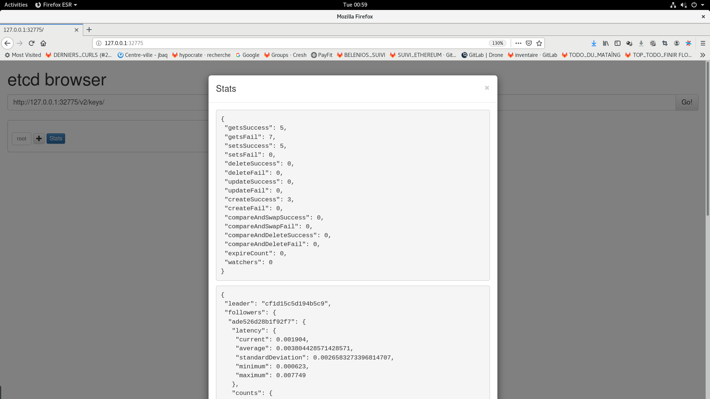
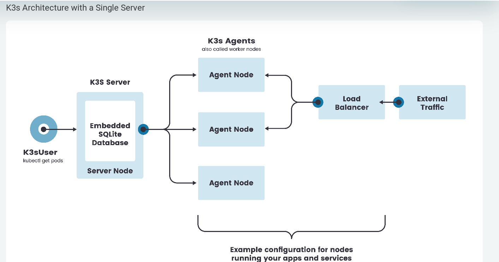

# The best I can do with k3s


### Provision

* The first thing we need to do with k3s, is to install it.
* The way I want to install it, is a high availability mode :
  * the best way yot do that, as i found out, is to use `k3d`, also released by `Rancher` : https://k3d.io/


## IAAC Cycle

```bash
# ~/k3s-topgun$
export URI_REPO=https://github.com/pokusio/k3s-topgun.git
git clone ${URI_REPO} ~/k3s-topgun
cd ~/k3s-topgun
export FEATURE_ALIAS="k3d-install"
git checkout feature/${FEATURE_ALIAS}

export COMMIT_MESSAGE="feat. ${FEATURE_ALIAS} : "
export COMMIT_MESSAGE="${COMMIT_MESSAGE} Ajout de la recette d'installation K3S avec 3 masters "

# git flow feature start ${FEATURE_ALIAS}

git add --all && git commit -m "${COMMIT_MESSAGE}" && git push -u origin HEAD


# git push -u origin --all && git push -u origin --tags


```

# Docs references

* https://k3d.io/usage/commands/
* https://rancher.com/docs/k3s/latest/en/installation/install-options/server-config/#k3s-server-cli-help :  all those options you can pass from `k3d` to `k3s` server,  using tehe `k3d` ` --server-arg "<K3S OPTION>"`. Example  `--server-arg "--no-deploy=traefik"`
* an interesting option is for setting the TLS Certs for the `KUBECONFIG` SAN :
  * `--tls-san value`  (listener) Add additional hostname or IP as a Subject Alternative Name in the TLS cert
  * `k3d create cluster topgunCluster --server-arg "--no-deploy=traefik" --server-arg  "--tls-san value"` --masters 5 --workers 9 --api-port "0.0.0.0:6551"


## The TLS Certs in the KUBECONFIG

Oh les salopards, comme elle était chiante à rtrovuer celle-là :

```bash
docker version
kubectl version
uname -a
k3d version
k3d create cluster --help
```
* outputs :

```bash
jbl@pc-alienware-jbl:~$ docker version
Client: Docker Engine - Community
 Version:           19.03.8
 API version:       1.40
 Go version:        go1.12.17
 Git commit:        afacb8b7f0
 Built:             Wed Mar 11 01:26:02 2020
 OS/Arch:           linux/amd64
 Experimental:      false

Server: Docker Engine - Community
 Engine:
  Version:          19.03.8
  API version:      1.40 (minimum version 1.12)
  Go version:       go1.12.17
  Git commit:       afacb8b7f0
  Built:            Wed Mar 11 01:24:36 2020
  OS/Arch:          linux/amd64
  Experimental:     false
 containerd:
  Version:          1.2.13
  GitCommit:        7ad184331fa3e55e52b890ea95e65ba581ae3429
 runc:
  Version:          1.0.0-rc10
  GitCommit:        dc9208a3303feef5b3839f4323d9beb36df0a9dd
 docker-init:
  Version:          0.18.0
  GitCommit:        fec3683
jbl@pc-alienware-jbl:~$ kubectl version
Client Version: version.Info{Major:"1", Minor:"18", GitVersion:"v1.18.0", GitCommit:"9e991415386e4cf155a24b1da15becaa390438d8", GitTreeState:"clean", BuildDate:"2020-03-25T14:58:59Z", GoVersion:"go1.13.8", Compiler:"gc", Platform:"linux/amd64"}
Server Version: version.Info{Major:"1", Minor:"18", GitVersion:"v1.18.4+k3s1", GitCommit:"97b7a0e9df2883f08028fb7171c1e62fc1899a0c", GitTreeState:"clean", BuildDate:"2020-06-18T01:30:45Z", GoVersion:"go1.13.11", Compiler:"gc", Platform:"linux/amd64"}
jbl@pc-alienware-jbl:~$ uname -a
Linux pc-alienware-jbl 4.9.0-7-amd64 #1 SMP Debian 4.9.110-3+deb9u2 (2018-08-13) x86_64 GNU/Linux
jbl@pc-alienware-jbl:~$ k3d version
k3d version v3.0.0-rc.6
k3s version v1.18.4-k3s1 (default)
jbl@pc-alienware-jbl:~$ k3d --version
k3d version v3.0.0-rc.6
k3s version v1.18.4-k3s1 (default)
jbl@pc-alienware-jbl:~$ k3d create cluster --help

Create a new k3s cluster with containerized nodes (k3s in docker).
Every cluster will consist of at least 2 containers:
	- 1 master node container (k3s)
	- 1 loadbalancer container as the entrypoint to the cluster (nginx)

Usage:
  k3d create cluster NAME [flags]

Flags:
  -a, --api-port --api-port [HOST:]HOSTPORT                            Specify the Kubernetes API server port exposed on the LoadBalancer (Format: --api-port [HOST:]HOSTPORT)
                                                                        - Example: `k3d create -m 3 -a 0.0.0.0:6550` (default "random")
  -h, --help                                                           help for cluster
  -i, --image string                                                   Specify k3s image that you want to use for the nodes (default "docker.io/rancher/k3s:v1.18.4-k3s1")
      --k3s-agent-arg k3s agent                                        Additional args passed to the k3s agent command on worker nodes (new flag per arg)
      --k3s-server-arg k3s server                                      Additional args passed to the k3s server command on master nodes (new flag per arg)
  -m, --masters int                                                    Specify how many masters you want to create (default 1)
      --network string                                                 Join an existing network
      --no-image-volume                                                Disable the creation of a volume for importing images
      --no-lb                                                          Disable the creation of a LoadBalancer in front of the master nodes
  -p, --port [HOST:][HOSTPORT:]CONTAINERPORT[/PROTOCOL][@NODEFILTER]   Map ports from the node containers to the host (Format: [HOST:][HOSTPORT:]CONTAINERPORT[/PROTOCOL][@NODEFILTER])
                                                                        - Example: `k3d create -w 2 -p 8080:80@worker[0] -p 8081@worker[1]`
      --switch                                                         Directly switch the default kubeconfig's current-context to the new cluster's context (implies --update-kubeconfig)
      --timeout duration                                               Rollback changes if cluster couldn't be created in specified duration.
      --token string                                                   Specify a cluster token. By default, we generate one.
      --update-kubeconfig                                              Directly update the default kubeconfig with the new cluster's context
  -v, --volume --volume [SOURCE:]DEST[@NODEFILTER[;NODEFILTER...]]     Mount volumes into the nodes (Format: --volume [SOURCE:]DEST[@NODEFILTER[;NODEFILTER...]]
                                                                        - Example: `k3d create -w 2 -v /my/path@worker[0,1] -v /tmp/test:/tmp/other@master[0]`
      --wait                                                           Wait for the master(s) to be ready before returning. Use '--timeout DURATION' to not wait forever. (default true)
  -w, --workers int                                                    Specify how many workers you want to create

Global Flags:
      --verbose   Enable verbose output (debug logging)
jbl@pc-alienware-jbl:~$

```

le problème c'est que l'option `--server-arg` ne fonctionne pas avec un `K3D` version `3.x`..

mais j'ai trouvé l'alternative :

```bash
k3d create cluster --k3s-server-arg "k3s server --tls-san example.com" topgunCluster --masters 5 --workers 9 --api-port "0.0.0.0:6551"
export KUBECONFIG=$(k3d get kubeconfig topgunCluster)
kubectl get all,nodes --all-namespaces
cat $KUBECONFIG
```

* tried another (so much fun) :

```bash
# this one works for sure with k3d version [3.0.0-rc.6]
k3d create cluster topgunCluster --masters 5 --workers 9 --no-lb
# this one also works with k3d version [3.0.0-rc.6]
k3d create cluster topgunCluster --masters 5 --workers 9
# another one that worked, but if you "k3s server --tls-san alien.io" instead of
# "k3s server --tls-san \"alien.io\"", then it fails
k3d create cluster --k3s-server-arg "k3s server --tls-san \"alien.io\"" topgunCluster --masters 5 --workers 9
#
k3d create cluster --k3s-server-arg "k3s server --tls-san \"192.168.1.28\"" topgunCluster --masters 5 --workers 9

#
```

* clean evertyhing up between two clusters seems required (when you tear down one, to create another) :

```bash
k3d delete cluster topgunCluster
sudo rm /etc/docker/*.json
docker system prune -f --all && docker system prune -f --volumes
sudo systemctl daemon-reload
sudo systemctl restart docker
```

* I opened an [issue on k3d](https://github.com/rancher/k3d/issues/295) for this clean up requirement.
* Indeed, you can see below an example of a cluster creation that fails without cleaning, and succeeds after cleaning up :

```bash
jbl@pc-alienware-jbl:~$ k3d create cluster --k3s-server-arg "k3s server --tls-san \"192.168.1.28\"" topgunCluster --masters 5 --workers 9
INFO[0000] Created network 'k3d-topgunCluster'
INFO[0000] Created volume 'k3d-topgunCluster-images'
INFO[0000] Creating initializing master node
INFO[0000] Creating node 'k3d-topgunCluster-master-0'
INFO[0013] Creating node 'k3d-topgunCluster-master-1'
INFO[0014] Creating node 'k3d-topgunCluster-master-2'
INFO[0016] Creating node 'k3d-topgunCluster-master-3'
INFO[0018] Creating node 'k3d-topgunCluster-master-4'
INFO[0019] Creating node 'k3d-topgunCluster-worker-0'
INFO[0021] Creating node 'k3d-topgunCluster-worker-1'
INFO[0022] Creating node 'k3d-topgunCluster-worker-2'
INFO[0023] Creating node 'k3d-topgunCluster-worker-3'
INFO[0025] Creating node 'k3d-topgunCluster-worker-4'
INFO[0026] Creating node 'k3d-topgunCluster-worker-5'
INFO[0027] Creating node 'k3d-topgunCluster-worker-6'
INFO[0028] Creating node 'k3d-topgunCluster-worker-7'
INFO[0029] Creating node 'k3d-topgunCluster-worker-8'
INFO[0030] Creating LoadBalancer 'k3d-topgunCluster-masterlb'
ERRO[0031] Failed waiting for log message 'start worker processes' from node 'k3d-topgunCluster-masterlb'
ERRO[0031] Failed to bring up all master nodes (and loadbalancer) in time. Check the logs:
ERRO[0031] >>> Node 'k3d-topgunCluster-masterlb' (container '3465df51d5ec289044eb794f76d605d1e7fdd2d51e9925b0fdb5ab66d6069166') not running
ERRO[0031] Failed to bring up cluster
ERRO[0031] Failed to create cluster >>> Rolling Back
INFO[0031] Deleting cluster 'topgunCluster'
INFO[0032] Deleted k3d-topgunCluster-master-0
INFO[0032] Deleted k3d-topgunCluster-master-1
INFO[0033] Deleted k3d-topgunCluster-master-2
INFO[0034] Deleted k3d-topgunCluster-master-3
INFO[0034] Deleted k3d-topgunCluster-master-4
INFO[0035] Deleted k3d-topgunCluster-worker-0
INFO[0036] Deleted k3d-topgunCluster-worker-1
INFO[0036] Deleted k3d-topgunCluster-worker-2
INFO[0037] Deleted k3d-topgunCluster-worker-3
INFO[0038] Deleted k3d-topgunCluster-worker-4
INFO[0038] Deleted k3d-topgunCluster-worker-5
INFO[0039] Deleted k3d-topgunCluster-worker-6
INFO[0040] Deleted k3d-topgunCluster-worker-7
INFO[0040] Deleted k3d-topgunCluster-worker-8
INFO[0040] Deleted k3d-topgunCluster-masterlb
INFO[0040] Deleting cluster network '7935e282ead88eaa3857b79ec4cc22cc2303a7066deac4d7c6dfca7dd0d15ec8'
FATA[0040] Cluster creation FAILED, all changes have been rolled back!
jbl@pc-alienware-jbl:~$ k3d delete cluster topgunCluster
FATA[0000] No nodes found for cluster 'topgunCluster'
jbl@pc-alienware-jbl:~$ sudo rm /etc/docker/*.json
jbl@pc-alienware-jbl:~$ docker system prune -f --all && docker system prune -f --volumes
Deleted Images:
untagged: rancher/k3s:v1.18.4-k3s1
untagged: rancher/k3s@sha256:2555ed1896512b320c175859a95a5f1d6a2c64b501a84bc45d853a9bd0be0dfd
deleted: sha256:8600923bc2c7dda1d67732d4c9498f79204889d4a4619212e5301e8ebd88683c
deleted: sha256:9112bc341c35bc180f6526457537650bc9c281a60b4960d515422642e137cd6e
deleted: sha256:4a580f02a4fae85d3c01c88ac827b935db862e2842a4722a0073962f38b7704e
deleted: sha256:ec1433ebbebd8aefcdc2d9f8bec9668defb5d1e0984a4035c510f99fe4ba0562
untagged: rancher/k3d-proxy:v3.0.0-rc.6
untagged: rancher/k3d-proxy@sha256:a9d150f33da45cfab590d8094b034d30510f142332fbb007c1e5030aaddf304f
deleted: sha256:4b44f08c525f5c026222c8d78635672e3a6150179562f9f9b572a66d9a104600
deleted: sha256:818da9004fb9448cb438215e04e9c9c5853561c54d17cdc187b0d493c369c314
deleted: sha256:335fc598937327294d4748e2bc3eec1d6589f7c485a0690d54e0397df64800eb
deleted: sha256:ec88223b6e690f3a2285f3c13dcff4e18ab75411fc2b63f363d3ec676371487a
deleted: sha256:7c5c8fccda028cec476ee644a77046ef66b7d9eaa3c57ddc1ac8f64a9aafe07c
deleted: sha256:c08fbfc0bf8619da11d55fcaad512b2824bd3add3078d3b8ca0e68e9c5e41ab5
deleted: sha256:f1b5933fe4b5f49bbe8258745cf396afe07e625bdab3168e364daf7c956b6b81

Total reclaimed space: 194MB
Deleted Volumes:
k3d-topgunCluster-images

Total reclaimed space: 0B
jbl@pc-alienware-jbl:~$ sudo systemctl daemon-reload
jbl@pc-alienware-jbl:~$ sudo systemctl restart docker
jbl@pc-alienware-jbl:~$ k3d delete cluster topgunCluster
FATA[0000] No nodes found for cluster 'topgunCluster'
jbl@pc-alienware-jbl:~$ k3d create cluster --k3s-server-arg "k3s server --tls-san \"192.168.1.28\"" topgunCluster --masters 5 --workers 9
INFO[0000] Created network 'k3d-topgunCluster'
INFO[0000] Created volume 'k3d-topgunCluster-images'
INFO[0000] Creating initializing master node
INFO[0000] Creating node 'k3d-topgunCluster-master-0'
INFO[0001] Pulling image 'docker.io/rancher/k3s:v1.18.4-k3s1'
INFO[0018] Creating node 'k3d-topgunCluster-master-1'
INFO[0019] Creating node 'k3d-topgunCluster-master-2'
INFO[0021] Creating node 'k3d-topgunCluster-master-3'
INFO[0023] Creating node 'k3d-topgunCluster-master-4'
INFO[0025] Creating node 'k3d-topgunCluster-worker-0'
INFO[0026] Creating node 'k3d-topgunCluster-worker-1'
INFO[0027] Creating node 'k3d-topgunCluster-worker-2'
INFO[0029] Creating node 'k3d-topgunCluster-worker-3'
INFO[0031] Creating node 'k3d-topgunCluster-worker-4'
INFO[0032] Creating node 'k3d-topgunCluster-worker-5'
INFO[0034] Creating node 'k3d-topgunCluster-worker-6'
INFO[0036] Creating node 'k3d-topgunCluster-worker-7'
INFO[0038] Creating node 'k3d-topgunCluster-worker-8'
INFO[0039] Creating LoadBalancer 'k3d-topgunCluster-masterlb'
INFO[0040] Pulling image 'docker.io/rancher/k3d-proxy:v3.0.0-rc.6'
INFO[0046] Cluster 'topgunCluster' created successfully!
INFO[0046] You can now use it like this:
export KUBECONFIG=$(k3d get kubeconfig topgunCluster)
kubectl cluster-info
jbl@pc-alienware-jbl:~$ export KUBECONFIG=$(k3d get kubeconfig topgunCluster)
jbl@pc-alienware-jbl:~$ kubectl get all,nodes
NAME                 TYPE        CLUSTER-IP   EXTERNAL-IP   PORT(S)   AGE
service/kubernetes   ClusterIP   10.43.0.1    <none>        443/TCP   52s

NAME                              STATUS   ROLES    AGE   VERSION
node/k3d-topguncluster-master-0   Ready    master   49s   v1.18.4+k3s1
node/k3d-topguncluster-master-2   Ready    master   35s   v1.18.4+k3s1
node/k3d-topguncluster-master-1   Ready    master   32s   v1.18.4+k3s1
node/k3d-topguncluster-worker-2   Ready    <none>   34s   v1.18.4+k3s1
node/k3d-topguncluster-worker-1   Ready    <none>   34s   v1.18.4+k3s1
node/k3d-topguncluster-master-4   Ready    master   31s   v1.18.4+k3s1
node/k3d-topguncluster-worker-3   Ready    <none>   32s   v1.18.4+k3s1
node/k3d-topguncluster-worker-4   Ready    <none>   31s   v1.18.4+k3s1
node/k3d-topguncluster-worker-5   Ready    <none>   28s   v1.18.4+k3s1
node/k3d-topguncluster-worker-6   Ready    <none>   27s   v1.18.4+k3s1
node/k3d-topguncluster-master-3   Ready    master   26s   v1.18.4+k3s1
node/k3d-topguncluster-worker-8   Ready    <none>   24s   v1.18.4+k3s1
node/k3d-topguncluster-worker-0   Ready    <none>   37s   v1.18.4+k3s1
node/k3d-topguncluster-worker-7   Ready    <none>   23s   v1.18.4+k3s1
jbl@pc-alienware-jbl:~$
```


* Okay, now I tried again the tls san (so I can kubectl remotely ), and succeeded this way :
  * I create the cluster with the `k3d create cluster --k3s-server-arg "k3s server --tls-san \"192.168.1.28,0.0.0.0\"" topgunCluster --masters 3 --workers 5` command:

```bash
jbl@pc-alienware-jbl:~$ k3d create cluster --k3s-server-arg "k3s server --tls-san \"192.168.1.28,0.0.0.0\"" topgunCluster --masters 3 --workers 5
INFO[0000] Created network 'k3d-topgunCluster'
INFO[0000] Created volume 'k3d-topgunCluster-images'
INFO[0000] Creating initializing master node
INFO[0000] Creating node 'k3d-topgunCluster-master-0'
INFO[0012] Creating node 'k3d-topgunCluster-master-1'
INFO[0014] Creating node 'k3d-topgunCluster-master-2'
INFO[0015] Creating node 'k3d-topgunCluster-worker-0'
INFO[0016] Creating node 'k3d-topgunCluster-worker-1'
INFO[0018] Creating node 'k3d-topgunCluster-worker-2'
INFO[0019] Creating node 'k3d-topgunCluster-worker-3'
INFO[0020] Creating node 'k3d-topgunCluster-worker-4'
INFO[0021] Creating LoadBalancer 'k3d-topgunCluster-masterlb'
INFO[0023] Cluster 'topgunCluster' created successfully!
INFO[0023] You can now use it like this:
export KUBECONFIG=$(k3d get kubeconfig topgunCluster)
kubectl cluster-info
jbl@pc-alienware-jbl:~$ export KUBECONFIG=$(k3d get kubeconfig topgunCluster)
jbl@pc-alienware-jbl:~$ kubectl get all,nodes
NAME                 TYPE        CLUSTER-IP   EXTERNAL-IP   PORT(S)   AGE
service/kubernetes   ClusterIP   10.43.0.1    <none>        443/TCP   31s

NAME                              STATUS   ROLES    AGE   VERSION
node/k3d-topguncluster-master-0   Ready    master   28s   v1.18.4+k3s1
node/k3d-topguncluster-worker-3   Ready    <none>   17s   v1.18.4+k3s1
node/k3d-topguncluster-worker-4   Ready    <none>   16s   v1.18.4+k3s1
node/k3d-topguncluster-master-1   Ready    master   16s   v1.18.4+k3s1
node/k3d-topguncluster-worker-2   Ready    <none>   13s   v1.18.4+k3s1
node/k3d-topguncluster-worker-0   Ready    <none>   16s   v1.18.4+k3s1
node/k3d-topguncluster-worker-1   Ready    <none>   14s   v1.18.4+k3s1
node/k3d-topguncluster-master-2   Ready    master   14s   v1.18.4+k3s1
jbl@pc-alienware-jbl:~$ cat $KUBECONFIG
apiVersion: v1
clusters:
- cluster:
    certificate-authority-data: LS0tLS1CRUdJTiBDRVJUSUZJQ0FURS0tLS0tCk1JSUJWakNCL3FBREFnRUNBZ0VBTUFvR0NDcUdTTTQ5QkFNQ01DTXhJVEFmQmdOVkJBTU1HR3N6Y3kxelpYSjIKWlhJdFkyRkFNVFU1TXpreE5UTTVOakFlRncweU1EQTNNRFV3TWpFMk16WmFGdzB6TURBM01ETXdNakUyTXpaYQpNQ014SVRBZkJnTlZCQU1NR0dzemN5MXpaWEoyWlhJdFkyRkFNVFU1TXpreE5UTTVOakJaTUJNR0J5cUdTTTQ5CkFnRUdDQ3FHU000OUF3RUhBMElBQkt2S1N5aDZQNUNPY08yQzdndjJLd2kycnM1eStsS1pTeVM2TkFMSnNKRUMKZUtpWFhydGFubCszSlNLMExBTVpITnBOcUtJYVdoRThWY0h6bUJROU1oeWpJekFoTUE0R0ExVWREd0VCL3dRRQpBd0lDcERBUEJnTlZIUk1CQWY4RUJUQURBUUgvTUFvR0NDcUdTTTQ5QkFNQ0EwY0FNRVFDSURLa3pHbk5md05uClp6TXppSHVFZWJsV08wamczNkJEVW5USUV0eTlyMldTQWlCVEd1MTNjZjVxZTMxVnZwTWhyTkplaG83Ni9IemIKQitIMnJOL3g1dDQwRFE9PQotLS0tLUVORCBDRVJUSUZJQ0FURS0tLS0tCg==
    server: https://0.0.0.0:38723
  name: k3d-topgunCluster
contexts:
- context:
    cluster: k3d-topgunCluster
    user: admin@k3d-topgunCluster
  name: k3d-topgunCluster
current-context: k3d-topgunCluster
kind: Config
preferences: {}
users:
- name: admin@k3d-topgunCluster
  user:
    password: a6fb7c6ebc0ee4b94395d080ea16e78e
    username: admin
jbl@pc-alienware-jbl:~$

```
  * Then I copy paster the kubeconfig file, and try to use it from a remote machine, and the strangest thing happened :

```bash
jibl@poste-devops-jbl-16gbram:~/k3s-topgun$ rm $KUBECONFIG
jibl@poste-devops-jbl-16gbram:~/k3s-topgun$ vi $KUBECONFIG
jibl@poste-devops-jbl-16gbram:~/k3s-topgun$ sed -i "s#0.0.0.0#192.168.1.28#g" $KUBECONFIG
jibl@poste-devops-jbl-16gbram:~/k3s-topgun$ kubectl get all,nodes
Unable to connect to the server: x509: certificate is valid for 0.0.0.0, 10.43.0.1, 127.0.0.1, 172.20.0.2, 172.20.0.3, 172.20.0.4, not 192.168.1.28
jibl@poste-devops-jbl-16gbram:~/k3s-topgun$ sed -i "s#192.168.1.28#alien.io#g" $KUBECONFIG
jibl@poste-devops-jbl-16gbram:~/k3s-topgun$ kubectl get all,nodes
NAME                 TYPE        CLUSTER-IP   EXTERNAL-IP   PORT(S)   AGE
service/kubernetes   ClusterIP   10.43.0.1    <none>        443/TCP   85s

NAME                              STATUS   ROLES    AGE   VERSION
node/k3d-topguncluster-worker-4   Ready    <none>   70s   v1.18.4+k3s1
node/k3d-topguncluster-master-1   Ready    master   70s   v1.18.4+k3s1
node/k3d-topguncluster-worker-2   Ready    <none>   67s   v1.18.4+k3s1
node/k3d-topguncluster-worker-1   Ready    <none>   68s   v1.18.4+k3s1
node/k3d-topguncluster-master-0   Ready    master   82s   v1.18.4+k3s1
node/k3d-topguncluster-worker-0   Ready    <none>   70s   v1.18.4+k3s1
node/k3d-topguncluster-master-2   Ready    master   68s   v1.18.4+k3s1
node/k3d-topguncluster-worker-3   Ready    <none>   71s   v1.18.4+k3s1
jibl@poste-devops-jbl-16gbram:~/k3s-topgun$ ping -c 4 alien.io
PING traefik.alien.io (192.168.1.28) 56(84) bytes of data.
64 bytes from traefik.alien.io (192.168.1.28): icmp_seq=1 ttl=64 time=0.219 ms
64 bytes from traefik.alien.io (192.168.1.28): icmp_seq=2 ttl=64 time=0.159 ms
64 bytes from traefik.alien.io (192.168.1.28): icmp_seq=3 ttl=64 time=0.222 ms
64 bytes from traefik.alien.io (192.168.1.28): icmp_seq=4 ttl=64 time=0.201 ms

--- traefik.alien.io ping statistics ---
4 packets transmitted, 4 received, 0% packet loss, time 3049ms
rtt min/avg/max/mdev = 0.159/0.200/0.222/0.027 ms
```

* The strangest thing is that "it works with `alien.io`", and fails if `192.168.1.28`  is used in kubeconfig... Even though it is `192.168.1.28` that is passed with the `--tls-san` option...


## Size, number of masters and stability of the cluster

I had a very unstable cluster, when I used 5 masters, and 9 workers... Why, I do not know, : more tests to run here

#### Failures of the 3 masters / 5 workers cluster size

* I had failures with "the wmall sized" cluster, launched with `k3d create cluster --k3s-server-arg "k3s server --tls-san \"192.168.1.28,0.0.0.0\"" topgunCluster --masters 3 --workers 5`
* it was `master-0` which had a problem
* But I could bring back, after executing 4 / 5 times a docker restart :

```bash
docker logs -f k3d-topgunCluster-master-0
docker restart k3d-topgunCluster-master-0
```

What happened, I believe, according the master's logs, is that `etcd` was un reacheable or something like that. Here are le logs of the error :

```bash
W0705 02:59:02.564496       6 genericapiserver.go:409] Skipping API storage.k8s.io/v1alpha1 because it has no resources.
W0705 02:59:02.580125       6 genericapiserver.go:409] Skipping API apps/v1beta2 because it has no resources.
W0705 02:59:02.580140       6 genericapiserver.go:409] Skipping API apps/v1beta1 because it has no resources.
I0705 02:59:02.587582       6 plugins.go:158] Loaded 12 mutating admission controller(s) successfully in the following order: NamespaceLifecycle,LimitRanger,ServiceAccount,NodeRestriction,TaintNodesByCondition,Priority,DefaultTolerationSeconds,DefaultStorageClass,StorageObjectInUseProtection,RuntimeClass,DefaultIngressClass,MutatingAdmissionWebhook.
I0705 02:59:02.587596       6 plugins.go:161] Loaded 10 validating admission controller(s) successfully in the following order: LimitRanger,ServiceAccount,Priority,PersistentVolumeClaimResize,RuntimeClass,CertificateApproval,CertificateSigning,CertificateSubjectRestriction,ValidatingAdmissionWebhook,ResourceQuota.
Assertion failed: db->follower == NULL (src/db.c: db__open_follower: 44)
```


Another thing : I had the exact same issue with `master-1`, but funnily, this time, I could still `kubectl` against the cluster no pb.

I also used the same `docker restart` to bring it back up, and i had another error (`master-1` looking for a leader, probably `master-0` I guess) :

```bash
time="2020-07-05T03:02:51.203259175Z" level=warning msg="no known leader address=172.18.0.2:6443 attempt=32"
time="2020-07-05T03:02:52.203821393Z" level=warning msg="no known leader address=172.18.0.2:6443 attempt=33"
time="2020-07-05T03:02:53.204529623Z" level=warning msg="no known leader address=172.18.0.2:6443 attempt=34"
time="2020-07-05T03:02:54.205110108Z" level=warning msg="no known leader address=172.18.0.2:6443 attempt=35"
time="2020-07-05T03:02:55.205734162Z" level=warning msg="no known leader address=172.18.0.2:6443 attempt=36"
time="2020-07-05T03:02:56.206369934Z" level=warning msg="no known leader address=172.18.0.2:6443 attempt=37"
time="2020-07-05T03:02:57.207047518Z" level=warning msg="no known leader address=172.18.0.2:6443 attempt=38"
time="2020-07-05T03:02:58.207641037Z" level=warning msg="no known leader address=172.18.0.2:6443 attempt=39"
time="2020-07-05T03:02:59.208261204Z" level=warning msg="no known leader address=172.18.0.2:6443 attempt=40"
time="2020-07-05T03:03:00.208872535Z" level=warning msg="no known leader address=172.18.0.2:6443 attempt=41"
time="2020-07-05T03:03:01.209401569Z" level=warning msg="no known leader address=172.18.0.2:6443 attempt=42"
time="2020-07-05T03:03:02.209996276Z" level=warning msg="no known leader address=172.18.0.2:6443 attempt=43"
time="2020-07-05T03:03:03.210692553Z" level=warning msg="no known leader address=172.18.0.2:6443 attempt=44"
time="2020-07-05T03:03:04.211298165Z" level=warning msg="no known leader address=172.18.0.2:6443 attempt=45"
time="2020-07-05T03:03:05.211905541Z" level=warning msg="no known leader address=172.18.0.2:6443 attempt=46"
time="2020-07-05T03:03:06.212532503Z" level=warning msg="no known leader address=172.18.0.2:6443 attempt=47"
time="2020-07-05T03:03:07.213100797Z" level=warning msg="no known leader address=172.18.0.2:6443 attempt=48"
time="2020-07-05T03:03:08.214177063Z" level=warning msg="no known leader address=172.18.0.2:6443 attempt=49"
time="2020-07-05T03:03:09.214769876Z" level=warning msg="no known leader address=172.18.0.2:6443 attempt=50"
```

* I then checked containers with `docker ps -a`, and indeed : `master-0` was down again, with the same db error.
* Note that it happened many times, and evry time I could bring everything up, by restarting all master nodes with a :

```bash
docker restart k3d-topgunCluster-master-1 && docker logs -f k3d-topgunCluster-master-1
```

Alright, so here the failing point is very likely to be on the data storage, and I will try the following solution :
* I need a highly available ETCD
* So i will provision that ETCD , "under `k3s`"
* and I will connect the cluster to the Etcd service, using the `--datastore-*` options of `K3S`, see https://rancher.com/docs/k3s/latest/en/installation/datastore/


### ETCD integration

Alright, now the next test :
* bring an etcd serice with docker-compose or in any k8s cluster (could be a postgres)
* and then I will create my cluster that way, to plug in the `ETCD` (`postgres`) :

```bash

k3d create cluster --k3s-server-arg "k3s server --tls-san \"192.168.1.28,0.0.0.0\"" \
                   --k3s-server-arg "k3s server --datastore-endpoint \"value\"" \
                   --k3s-server-arg "k3s server --datastore-cafile \"value\"" \
                   --k3s-server-arg "k3s server --datastore-certfile \"value\"" \
                   --k3s-server-arg "k3s server --datastore-keyfile \"value\"" \
                   topgunCluster2 --masters 3 --workers 5

```


<table>
<thead>
<tr>
<th>CLI Flag</th>
<th>Environment Variable</th>
<th>Description</th>
</tr>
</thead>

<tbody>
<tr>
<td><span style="white-space: nowrap"><code>--datastore-endpoint</code></span></td>
<td><code>K3S_DATASTORE_ENDPOINT</code></td>
<td>Specify a PostgresSQL, MySQL, or etcd connection string. This is a string used to describe the connection to the datastore. The structure of this string is specific to each backend and is detailed below.</td>
</tr>

<tr>
<td><span style="white-space: nowrap"><code>--datastore-cafile</code></span></td>
<td><code>K3S_DATASTORE_CAFILE</code></td>
<td>TLS Certificate Authority (CA) file used to help secure communication with the datastore. If your datastore serves requests over TLS using a certificate signed by a custom certificate authority, you can specify that CA using this parameter so that the K3s client can properly verify the certificate.</td>
</tr>

<tr>
<td><span style="white-space: nowrap"><code>--datastore-certfile</code></span></td>
<td><code>K3S_DATASTORE_CERTFILE</code></td>
<td>TLS certificate file used for client certificate based authentication to your datastore. To use this feature, your datastore must be configured to support client certificate based authentication. If you specify this parameter, you must also specify the <code>datastore-keyfile</code> parameter.</td>
</tr>

<tr>
<td><span style="white-space: nowrap"><code>--datastore-keyfile</code></span></td>
<td><code>K3S_DATASTORE_KEYFILE</code></td>
<td>TLS key file used for client certificate based authentication to your datastore. See the previous <code>datastore-certfile</code> parameter for more details.</td>
</tr>
</tbody>
</table>


### Quick ETCD

I found one that should work :

```bash
git clone https://github.com/dwilbraham/docker-compose-etcd
cd docker-compose-etcd/
git clone https://github.com/henszey/etcd-browser/ etcd-browser/
dcoker-compose up -d
```

* And now the source code for that `etcd` s in this repo :
  * So here is how to bring it up : `cd documentation/etcd/example && docker-compose up -d`
  * And how to test ETCD is fine, there and ready :

```bash
etcd=$(bin/service_address.sh etcd0 2379)
curl $etcd/v2/keys
curl $etcd/v2/keys/foo -XPUT -d value=bar

etcd_all="{$(bin/service_address.sh etcd0 2379),$(bin/service_address.sh etcd1 2379),$(bin/service_address.sh etcd2 2379)}"
curl $etcd_all/v2/keys

curl $etcd_all/v2/stats/leader
```

  * stdout of the test (expected `mocha chai http`):
```bash
jbl@pc-alienware-jbl:~/docker-compose-etcd$ etcd=$(bin/service_address.sh etcd0 2379)
jbl@pc-alienware-jbl:~/docker-compose-etcd$ curl $etcd/v2/keys
{"action":"get","node":{"dir":true}}
jbl@pc-alienware-jbl:~/docker-compose-etcd$ curl $etcd/v2/keys/foo -XPUT -d value=bar
{"action":"set","node":{"key":"/foo","value":"bar","modifiedIndex":8,"createdIndex":8}}
jbl@pc-alienware-jbl:~/docker-compose-etcd$
jbl@pc-alienware-jbl:~/docker-compose-etcd$ etcd_all="{$(bin/service_address.sh etcd0 2379),$(bin/service_address.sh etcd1 2379),$(bin/service_address.sh etcd2 2379)}"
jbl@pc-alienware-jbl:~/docker-compose-etcd$ curl $etcd_all/v2/keys

[1/3]: localhost:32770/v2/keys --> <stdout>
--_curl_--localhost:32770/v2/keys
{"action":"get","node":{"dir":true,"nodes":[{"key":"/foo","value":"bar","modifiedIndex":8,"createdIndex":8}]}}

[2/3]: localhost:32769/v2/keys --> <stdout>
--_curl_--localhost:32769/v2/keys
{"action":"get","node":{"dir":true,"nodes":[{"key":"/foo","value":"bar","modifiedIndex":8,"createdIndex":8}]}}

[3/3]: localhost:32768/v2/keys --> <stdout>
--_curl_--localhost:32768/v2/keys
{"action":"get","node":{"dir":true,"nodes":[{"key":"/foo","value":"bar","modifiedIndex":8,"createdIndex":8}]}}
jbl@pc-alienware-jbl:~/docker-compose-etcd$
jbl@pc-alienware-jbl:~/docker-compose-etcd$ curl $etcd_all/v2/stats/leader

[1/3]: localhost:32770/v2/stats/leader --> <stdout>
--_curl_--localhost:32770/v2/stats/leader
{"message":"not current leader"}
[2/3]: localhost:32769/v2/stats/leader --> <stdout>
--_curl_--localhost:32769/v2/stats/leader
{"leader":"ade526d28b1f92f7","followers":{"cf1d15c5d194b5c9":{"latency":{"current":0.002654,"average":0.0043555,"standardDeviation":0.003814415289398888,"minimum":0.001218,"maximum":0.01348},"counts":{"fail":0,"success":8}},"d282ac2ce600c1ce":{"latency":{"current":0.001708,"average":0.0042092499999999995,"standardDeviation":0.002915217005215907,"minimum":0.001708,"maximum":0.009956},"counts":{"fail":0,"success":8}}}}
[3/3]: localhost:32768/v2/stats/leader --> <stdout>
--_curl_--localhost:32768/v2/stats/leader
{"message":"not current leader"}jbl@pc-alienware-jbl:~/docker-compose-etcd$

```


## The Etcd Browser for the Etcd external datastore service for the K3D cluster

https://rancher.com/docs/k3s/latest/en/installation/ha/



So in here , will we see things happen because of the `k3d` `Kubernetes` Cluster, iusing this `etcd` service as external db


## `K3S` Architecture for high availability

* Default arhchtiecture for `k3s` is one server and an embedded datastore in the one unique server :



* `HA` arhchtiecture for `k3s` is many servers and an external datastore :


