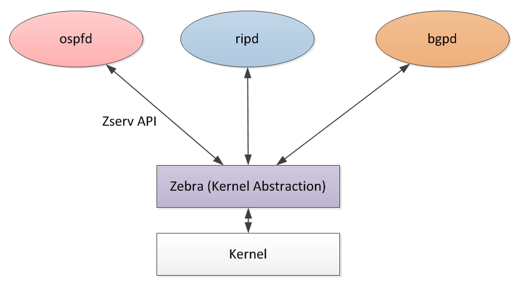

<!DOCTYPE html>
<html lang="en">

  <head>
    <meta charset="utf-8">
    <meta name="viewport" content="width=device-width, initial-scale=1.0">
    <meta http-equiv="Content-Language" content="en">

    <meta name="author" content="Matt Oswalt">
    <meta name="description" content="I have been getting more interested in open-source networking software, and I figured it was time to write a post comparing some of the more popular open source projects in this space.
Not only do we have several options (which hasn&rsquo;t always been the case) for running routing protocols in FOSS, but we also have a variety of use cases that are increasing in popularity (using BGP for SDN-type purposes, not just to do internet peering).">
    <meta name="keywords" content="programming,networks,automation,infrastructure,rust,golang">

    <meta name="twitter:card" content="summary_large_image"/>
<meta name="twitter:image" content="https://oswalt.dev/avatar.jpg"/>

<meta name="twitter:title" content="Open Source Routing: A Comparison"/>
<meta name="twitter:description" content="I have been getting more interested in open-source networking software, and I figured it was time to write a post comparing some of the more popular open source projects in this space.
Not only do we have several options (which hasn&rsquo;t always been the case) for running routing protocols in FOSS, but we also have a variety of use cases that are increasing in popularity (using BGP for SDN-type purposes, not just to do internet peering)."/>

    <meta property="og:title" content="Open Source Routing: A Comparison" />
<meta property="og:description" content="I have been getting more interested in open-source networking software, and I figured it was time to write a post comparing some of the more popular open source projects in this space.
Not only do we have several options (which hasn&rsquo;t always been the case) for running routing protocols in FOSS, but we also have a variety of use cases that are increasing in popularity (using BGP for SDN-type purposes, not just to do internet peering)." />
<meta property="og:type" content="article" />
<meta property="og:url" content="https://oswalt.dev/2015/05/open-source-routing-a-comparison/" />
<meta property="og:image" content="https://oswalt.dev/avatar.jpg"/>
<meta property="article:published_time" content="2015-05-22T00:00:00+00:00" />
<meta property="article:modified_time" content="2015-05-22T00:00:00+00:00" /><meta property="og:site_name" content="Matt Oswalt" />

    <title>
  Open Source Routing: A Comparison · Matt Oswalt
</title>

      <link rel="canonical" href="https://oswalt.dev/2015/05/open-source-routing-a-comparison/">

    <link rel="preconnect" href="https://fonts.gstatic.com">

    <link rel="preload" href="https://fonts.googleapis.com/css?family=Lato:400,700%7CMerriweather:300,700%7CSource+Code+Pro:400,700&display=swap" as="style" onload="this.onload=null;this.rel='stylesheet'">
    <noscript><link rel="stylesheet" href="https://fonts.googleapis.com/css?family=Lato:400,700%7CMerriweather:300,700%7CSource+Code+Pro:400,700&display=swap"></noscript>
    <link rel="preload" href="https://cdn.jsdelivr.net/npm/fork-awesome@1.1.7/css/fork-awesome.min.css"
      integrity="sha256-gsmEoJAws/Kd3CjuOQzLie5Q3yshhvmo7YNtBG7aaEY=" crossorigin="anonymous" as="style" onload="this.onload=null;this.rel='stylesheet'">
    <noscript><link rel="stylesheet" href="https://cdn.jsdelivr.net/npm/fork-awesome@1.1.7/css/fork-awesome.min.css"
      integrity="sha256-gsmEoJAws/Kd3CjuOQzLie5Q3yshhvmo7YNtBG7aaEY=" crossorigin="anonymous"></noscript>

    <link rel="stylesheet" href="https://cdn.jsdelivr.net/npm/normalize.css@8/normalize.min.css">

      <link rel="stylesheet" href="https://oswalt.dev/css/coder.min.f01c647a0d25b40da992a37c3376291185eed8a50ced8c26cc2c0bcfe38c97df.css" integrity="sha256-8Bxkeg0ltA2pkqN8M3YpEYXu2KUM7YwmzCwLz&#43;OMl98=" crossorigin="anonymous" media="screen" />

        <link rel="stylesheet" href="https://oswalt.dev/css/coder-dark.min.126ad3988d46bdae6217a11105b53c9662bca05f39d42d3c0fb366919d334620.css" integrity="sha256-EmrTmI1Gva5iF6ERBbU8lmK8oF851C08D7NmkZ0zRiA=" crossorigin="anonymous" media="screen" />

    <link rel="icon" type="image/png" href="https://oswalt.dev/images/favicon-32x32.png" sizes="32x32">
    <link rel="icon" type="image/png" href="https://oswalt.dev/images/favicon-16x16.png" sizes="16x16">

    <link rel="apple-touch-icon" href="https://oswalt.dev/images/apple-touch-icon.png">
    <link rel="apple-touch-icon" sizes="180x180" href="https://oswalt.dev/images/apple-touch-icon.png">

    <meta name="generator" content="Hugo 0.78.2" />
  </head>

  <body class="colorscheme-dark"
        onload=""
  >

    <a id="dark-mode-toggle" class="colorscheme-toggle">
        <i class="fa fa-adjust fa-fw" aria-hidden="true"></i>
    </a>

    <main class="wrapper">
      <nav class="navigation">
  <section class="container">
    <a class="navigation-title" href="https://oswalt.dev/">
      Matt Oswalt
    </a>

      <input type="checkbox" id="menu-toggle" />
      <label class="menu-button float-right" for="menu-toggle">
        <i class="fa fa-bars fa-fw" aria-hidden="true"></i>
      </label>
      <ul class="navigation-list">

            <li class="navigation-item">
              <a class="navigation-link" href="https://oswalt.dev/">Home</a>
            </li>

            <li class="navigation-item">
              <a class="navigation-link" href="https://oswalt.dev/about/">About</a>
            </li>

            <li class="navigation-item">
              <a class="navigation-link" href="https://oswalt.dev/categories/programming/">Programming</a>
            </li>

            <li class="navigation-item">
              <a class="navigation-link" href="https://oswalt.dev/categories/infrastructure/">Infrastructure</a>
            </li>

            <li class="navigation-item">
              <a class="navigation-link" href="https://oswalt.dev/categories/personal/">Personal</a>
            </li>

            <li class="navigation-item">
              <a class="navigation-link" href="https://oswalt.dev/bookshelf/">Bookshelf</a>
            </li>

      </ul>

  </section>
</nav>

      

  <section class="container page">
  <article>
    <header>
      <h1>Open Source Routing: A Comparison</h1>
    </header>

    
I have been getting more interested in open-source networking software, and I figured it was time to write a post comparing some of the more popular open source projects in this space.

Not only do we have several options (which hasn&rsquo;t always been the case) for running routing protocols in FOSS, but we also have a variety of use cases that are increasing in popularity  (using BGP for SDN-type purposes, not just to do internet peering). So isn&rsquo;t an idea limited to enthusiasts who like to spin their own router - this kind of software has very interesting large-scale applications as well.

This won&rsquo;t be a comprehensive list, just the top three that I&rsquo;ve been looking into. I also won&rsquo;t be going into too much detail on how to set all this software up - I&rsquo;m saving that for a follow-up post.

<h1 id="quagga">Quagga</h1>

Quagga is at the top of this list primarily because from my perspective, it is the most well-known. It is best to think of Quagga as a collection of smaller daemons, each with a specific task. This task may be to run a routing protocol like OSPF or BGP, or it may be something else.

In this design, the Zebra daemon is responsible for interacting with the kernel, and provides a simple API (called <a href="https://www.nongnu.org/quagga/docs/docs-info.html#Zebra-Protocol">Zserv</a>) for the other daemons to consume, so they don&rsquo;t need to make kernel calls directly.

The other daemons run their respective protocols. You can configure Quagga so that all of these daemons pull their configuration from the same place, or by individually configuring each daemon.

<pre><code><a href="/cdn-cgi/l/email-protection" class="__cf_email__" data-cfemail="7a0c1b1d081b140e3a084b">[email&#160;protected]</a>:~$ telnet localhost 2605
Trying 127.0.0.1...
Connected to localhost.
Escape character is '^]'.
BGP# show ip bgp
BGP table version is 0, local router ID is 1.1.1.1
Status codes: s suppressed, d damped, h history, * valid, &gt; best, i - internal,
              r RIB-failure, S Stale, R Removed
Origin codes: i - IGP, e - EGP, ? - incomplete

   Network          Next Hop            Metric LocPrf Weight Path
*&gt; 1.1.1.0/24       0.0.0.0                  0         32768 i
*&gt; 2.2.2.0/24       192.168.12.12                          0 121 i
*&gt; 3.3.3.0/24       192.168.31.13                          0 63000 63000 63000 131 i
</code></pre>

It&rsquo;s worth mentioning that Quagga comes with a utility called &ldquo;vtysh&rdquo; that simplifies this process, and serves as a single front-end for all the daemons.

For those familiar with Cisco IOS syntax, you&rsquo;ll notice that the Quagga configuration syntax is nearly identical:

<pre><code>BGP# show run

Current configuration:
!
hostname BGP
password Quagga
enable password Quagga
log file /var/log/quagga/bgpd.log
log stdout
log syslog
!
bgp multiple-instance
!
router bgp 111
 bgp router-id 1.1.1.1
 bgp log-neighbor-changes
 network 1.1.1.0/24
 neighbor 192.168.12.12 remote-as 121
 neighbor 192.168.12.12 next-hop-self
 neighbor 192.168.31.13 remote-as 131
 neighbor 192.168.31.13 next-hop-self
!
line vty
!
end
</code></pre>

In summary, Quagga is ideal for the network engineer that needs an open source alternative that closely resembles existing closed-source platforms like IOS that already have a lot of market share. For instance, <a href="http://docs.cumulusnetworks.com/display/CL22/Configuring+Quagga">Cumulus networks uses Quagga</a> to provide routing protocols on their switch operating system.

<h1 id="exabgp">Exabgp</h1>

<a href="https://github.com/Exa-Networks/exabgp">ExaBGP</a> is released under the BSD-3 license, and is described as &ldquo;the BGP swiss army knife of networking&rdquo;. It was created by Exa Networks for use with their own infrastructure, but it seems they were kind enough to release it to the public.

It&rsquo;s best not to think of ExaBGP as something you would use to construct a data plane device. This is typically used outside of the data plane to do path manipulation on a BGP network that may be composed of closed-source components. Many of the common use cases are very focused on ISP networks.

I view ExaBGP as a conduit between an organization&rsquo;s network and development teams. ExaBGP is written in Python and can be extended VERY easily (as we&rsquo;ll see shortly). It seems to have the right tools to bridge the gap between network operations and software development.

<blockquote>

I recommend you read the <a href="https://github.com/Exa-Networks/exabgp/blob/master/README.md">README</a> on the GitHub project for ideas on specific use cases - as well as look at the supported <a href="https://github.com/Exa-Networks/exabgp/wiki/Capabilities">AFI/SAFI</a>.

</blockquote>

There are some caveats you should be aware of:

<ul>
<li>Obviously, this is only focused on BGP. This doesn&rsquo;t help you for OSPF, etc.</li>
<li>The documentation seems to indicate Exabgp does not do any FIB manipulation (i.e. Linux kernel calls). However, it&rsquo;s worth mentioning you&rsquo;d probably want to use ExaBGP out of the data plane anyways (i.e. as a Route Reflector)</li>
</ul>

So how does ExaBGP allow us to do these things? As mentioned on the <a href="https://github.com/Exa-Networks/exabgp/wiki/Controlling-ExaBGP-:-_-README-first">wiki</a>:

<blockquote>

ExaBGP was designed to be controlled from third party applications. Your application will be launched by ExaBGP which will then interact with it.

</blockquote>

This struck me as extremely interesting - typical approaches to network automation go in the opposite direction, and are all about getting an API on your network device or software, whereas ExaBGP is built to be controlled by software written externally.

So how does this work? Essentially, ExaBGP monitors <a href="https://en.wikipedia.org/wiki/Standard_streams">stdout</a> for commands that it recognizes. So, ultimately any application that is able to print one of the <a href="https://github.com/Exa-Networks/exabgp/wiki/Controlling-ExaBGP-:-interacting-from-the-API">supported commands</a> to stdout can power ExaBGP.

Since ExaBGP is written in Python, most examples are also Python - but because of this generic interface, we can write our third party scripts or applications in just about any language we want.For instance, the following configuration will call a Python script called &ldquo;advroutes.py&rdquo;:

<pre><code>group test {
    router-id 2.2.2.2;
    neighbor 192.168.12.11 {
        local-address 192.168.12.12;
        local-as 121;
        peer-as 111;
        graceful-restart;
        process announce-routes {
            run /usr/bin/python /home/vagrant/exabgp/advroutes.py;
        }
    }
}
</code></pre>

The Python script referenced above is fairly simple.

<pre style="color:#e5e5e5;background-color:#000;-moz-tab-size:4;-o-tab-size:4;tab-size:4"><code class="language-python" data-lang="python">#!/usr/bin/env python

import sys
import time

# A list of networks to advertise
messages = [
&#39;announce route 2.2.2.0/24 next-hop 192.168.12.12&#39;,
]

time.sleep(2)

# Write networks out to stdout
while messages:
    message = messages.pop(0)
    sys.stdout.write( message + &#39;\n&#39;)
    sys.stdout.flush()
    time.sleep(1)

while True:
    time.sleep(1)</code></pre>

Here, we&rsquo;re using a simple Python list, but this could easily be something more dynamic. <a href="http://thepacketgeek.com/give-exabgp-an-http-api-with-flask/">See this interesting example</a> of using Flask to provide an HTTP API to ExaBGP.

For the simple stuff (setting up neighbors, advertising routes), the documentation (on the Github project&rsquo;s wiki) is sufficient, but the rest of it is fairly messy. This isn&rsquo;t a criticism of the project as much as it is a warning that not everything will be totally straightforward

In summary, use ExaBGP if you want to introduce a highly programmable layer to your BGP environment. There are some very powerful tools here for software-savvy shops that are looking to do interesting network stuff with software developed in-house. Think of ExaBGP as a tool for building abstractions on top of BGP.

<h1 id="bird">Bird</h1>

BIRD (BIRD Internet Routing Daemon) is probably the closest rival to Quagga in terms of popularity. It is a reasonably full-featured routing suite.

There are a few key differences, however. For one, BIRD comes with a <a href="http://bird.network.cz/?get_doc&amp;f=bird-4.html">configuration client</a> that is detached from the daemon. It communicates with the BIRD daemon via unix sockets by default, but can also communicate over the network too. More on that shortly.

The configuration syntax for BIRD is closer to JunOS than IOS, but still very different. The first thing you&rsquo;ll notice is that the configuration has an embedded basic scripting language; as an example, this is the logic I built to advertise a route and perform AS-path prepending:

<pre><code>filter out_loopback1 {
    if (net = 3.3.3.0/24) then
        {
            bgp_community.empty;
            bgp_path.prepend(63000);
            bgp_path.prepend(63000);
            bgp_path.prepend(63000);
            accept;
        }
    else reject;
}
</code></pre>

This &ldquo;function&rdquo; can be referenced in the BGP configuration. See how I&rsquo;m running the &ldquo;export&rdquo; command and referencing the above function in order to specify what I want to export.

<pre><code>protocol bgp ToQuagga {
    description &quot;Quagga&quot;;
    debug { states, events };
    local as 131;
    neighbor 192.168.31.11 as 111;
    next hop self;
    route limit 50000;
    default bgp_local_pref 300;
    import all;
    export filter out_loopback1;
    source address 192.168.31.13;
}
</code></pre>

Since I&rsquo;m no stranger to writing code, this works well for me. However, network operators accustomed to simpler mechanisms for doing simple stuff like advertising a network may find this a bit cumbersome.

Also, I&rsquo;m not used to using the term &ldquo;export&rdquo; to describe the advertisement of a route, but I noticed the entire BIRD project seemed to use this term everywhere.

I mentioned BIRD has a separate client utility that you can use to query the server. The BIRD project site has a <a href="https://gitlab.labs.nic.cz/labs/bird/wikis/Command_interface_examples">useful page</a> that contains a list of popular IOS commands, and provides the birdc equivalent.

<pre><code><a href="/cdn-cgi/l/email-protection" class="__cf_email__" data-cfemail="fe889f998c9f908abe8ccd">[email&#160;protected]</a>:~$ sudo birdc
BIRD 1.5.0 ready.
bird&gt; show route export ToQuagga
3.3.3.0/24         dev eth3 [direct1 04:16:21] * (240)
</code></pre>

Bird seems to be the ideal routing software for scripting-savvy network admins. The operating model is significantly different from any of the leading closed-source platforms like JunOS or IOS, but it&rsquo;s not so different that a network engineer couldn&rsquo;t pick it up.

<h1 id="honorable-mentions">Honorable Mentions</h1>

I wanted to keep this post to a &ldquo;top three&rdquo; kind of thing, but wanted to call out some others that I found.

<ul>
<li><a href="http://www.openbgpd.org/">OpenBGPD</a> is an interesting project, especially if you&rsquo;re a BSD fan.</li>
<li><a href="https://github.com/Orange-OpenSource/bagpipe-bgp">Bagpipe-BGP</a> is a project loosely associated with OpenStack Neutron aimed at providing BGP-based VPN services (i.e. eVPN) to virtual machines. Check out <a href="http://www.slideshare.net/ThomasMorin1/neutron-and-bgp-vpns-with-bagpipe">this presentation</a> for additional info.</li>
<li><a href="https://github.com/greearb/xorp.ct">XORP</a></li>
</ul>
<h1 id="conclusion">Conclusion</h1>

This wasn&rsquo;t a comprehensive list. In fact, the ExaBGP wiki <a href="https://github.com/Exa-Networks/exabgp/wiki/Other-OSS-BGP-implementations">provides a list of projects</a> (mostly focused on BGP) with VERY brief overview explanations of each, focused mostly on providing guidance to programmers on which project they should pick. My introduction was to introduce the &ldquo;typical&rdquo; network operator to open source routing.

Please read <a href="https://oswalt.dev/2015/06/open-source-routing-practical/">my next post</a> for an easy, quick way to get all of this set up on your laptop for you to play with.

  </article>
</section>

      

  <footer class="footer">
    <section class="container">

        ©

          2010 -

        2021
         Matt Oswalt

    </section>
  </footer>

    </main>

        

  </body>

</html>
